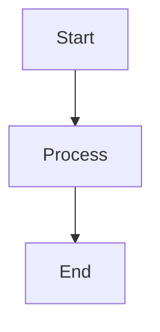

# md-mermaid-pdf Quick Start

## Installation

```bash
npm install -g md-mermaid-pdf
```

## Basic Usage

### Convert Markdown to PDF (one command)

```bash
md-to-pdf document.md
```

### Convert Markdown to HTML

```bash
md-to-html document.md
```

### Convert HTML to PDF

```bash
html-to-pdf document.html
```

## Common Options

```bash
# Custom title
md-to-pdf doc.md --title "My Document"

# Dark theme
md-to-pdf doc.md --theme dark

# Keep intermediate HTML
md-to-pdf doc.md --keep-html

# Extra wait time for complex diagrams
md-to-pdf doc.md --wait 5000

# Landscape orientation
html-to-pdf doc.html --landscape

# Custom output name
md-to-pdf input.md custom-output.pdf
```

## API Usage

```javascript
const { convertMarkdownFile, htmlToPdf } = require('md-mermaid-pdf');

// Markdown to HTML
convertMarkdownFile('input.md', 'output.html', {
  title: 'My Document',
  theme: 'dark',
});

// HTML to PDF
htmlToPdf('output.html', 'output.pdf', {
  waitTime: 2000,
});
```

## Mermaid Example

````markdown

````

## Requirements

- Node.js >=14.0.0
- Google Chrome or Chromium

## Troubleshooting

### Chrome not found?

```bash
# Set Chrome path
export CHROME_PATH=/path/to/chrome

# Or specify in command
md-to-pdf doc.md --chrome /path/to/chrome
```

### Diagrams not rendering?

```bash
# Increase wait time
md-to-pdf doc.md --wait 5000
```

## Help

```bash
md-to-html --help
html-to-pdf --help
md-to-pdf --help
```

## More Info

- Full documentation: See README.md
- Publishing guide: See PUBLISH.md
- Examples: See examples/sample.md
