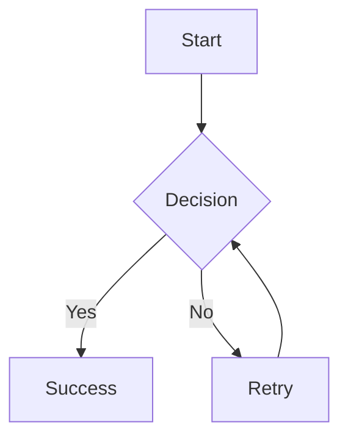
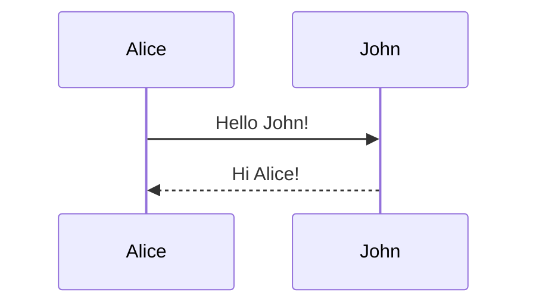

# 🧹 PDFMaid

> Your Markdown to PDF/HTML converter with beautiful Mermaid diagram rendering

[](https://www.npmjs.com/package/pdfmaid)
[](https://opensource.org/licenses/MIT)

A powerful and easy-to-use CLI tool for converting Markdown documents to HTML and PDF with full Mermaid diagram support. Perfect for technical documentation, specifications, and reports.

## ✨ Features

- 📊 **Full Mermaid.js Support** - All diagram types render beautifully:
  - Flowcharts
  - Sequence diagrams
  - Gantt charts
  - Class diagrams
  - State diagrams
  - Entity Relationship diagrams
  - And more!

- 🎨 **Professional Styling**
  - Clean, readable typography
  - Syntax-highlighted code blocks
  - Responsive tables
  - Dark mode support
  - Print-optimized layouts

- 🚀 **Easy to Use**
  - Simple unified CLI command
  - Programmatic API
  - Sensible defaults
  - Highly configurable

- 📄 **Multiple Output Formats**
  - HTML with interactive features
  - PDF with rendered diagrams
  - Direct Markdown → PDF conversion

## 📦 Installation

### Global Installation (CLI)

```bash
npm install -g pdfmaid
```

### Local Installation (API)

```bash
npm install pdfmaid
```

### Requirements

- **Node.js** 14.0.0 or higher
- **Google Chrome or Chromium** (for PDF generation)

## 🚀 Quick Start

### Basic Usage

```bash
# Convert Markdown to PDF (default)
pdfmaid document.md

# Convert Markdown to HTML
pdfmaid document.md -o html

# Specify output file
pdfmaid document.md -o report.pdf
```

### Common Use Cases

```bash
# Technical documentation with dark theme
pdfmaid api-spec.md -t "API Specification" --theme dark

# Complex diagrams (increase wait time)
pdfmaid architecture.md -w 5000

# Keep HTML for debugging
pdfmaid document.md --keep-html

# Convert existing HTML to PDF
pdfmaid document.html -o pdf

# Landscape orientation
pdfmaid slides.md --landscape
```

### API Usage

```javascript
const { convertMarkdownFile, htmlToPdf } = require('pdfmaid');

// Convert Markdown to HTML
convertMarkdownFile('input.md', 'output.html', {
  title: 'My Document',
  theme: 'dark',
});

// Convert HTML to PDF
htmlToPdf('output.html', 'output.pdf', {
  waitTime: 2000,
});
```

## 📖 CLI Documentation

### Command Syntax

```bash
pdfmaid <input> [options]
```

### Arguments

- `<input>` - Input file (.md, .markdown, .html, .htm)

### Options

| Option                        | Description                                  | Default               |
| ----------------------------- | -------------------------------------------- | --------------------- |
| `-o, --output <format\|file>` | Output format ('pdf' or 'html') or file path | pdf                   |
| `-f, --format <format>`       | Output format ('pdf' or 'html')              | pdf                   |
| `-t, --title <text>`          | Set document title                           | derived from filename |
| `--theme <name>`              | Theme: 'default' or 'dark'                   | default               |
| `-w, --wait <ms>`             | Wait time for Mermaid rendering              | 2000                  |
| `--landscape`                 | Use landscape orientation for PDF            | false                 |
| `--keep-html`                 | Keep intermediate HTML file                  | false                 |
| `--no-interactive`            | Disable interactive features                 | false                 |
| `--chrome <path>`             | Path to Chrome/Chromium executable           | auto-detect           |
| `-h, --help`                  | Show help message                            | -                     |
| `-v, --version`               | Show version number                          | -                     |

### Examples

#### Convert Markdown to PDF (default)

```bash
pdfmaid document.md
# Creates document.pdf
```

#### Convert Markdown to HTML

```bash
pdfmaid document.md -o html
# Creates document.html with interactive features
```

#### Custom Title and Theme

```bash
pdfmaid document.md -t "Technical Specification" --theme dark
# Creates document.pdf with dark theme
```

#### Complex Diagrams

```bash
pdfmaid architecture.md -w 5000
# Waits 5 seconds for complex Mermaid diagrams to render
```

#### Keep Intermediate HTML

```bash
pdfmaid document.md --keep-html
# Creates both document.pdf and document.html
```

#### Convert HTML to PDF

```bash
pdfmaid document.html -o pdf
# Creates document.pdf from existing HTML
```

#### Landscape Orientation

```bash
pdfmaid slides.md --landscape
# Creates landscape-oriented PDF
```

#### Specify Output File

```bash
pdfmaid input.md -o /path/to/output.pdf
# Creates PDF at specified location
```

## 🔧 API Reference

### `markdownToHtml(markdown, options)`

Convert Markdown string to HTML string.

**Parameters:**

- `markdown` (string): Markdown content
- `options` (object):
  - `title` (string): Document title
  - `theme` (string): 'default' or 'dark'
  - `includeStyles` (boolean): Include built-in styles (default: true)
  - `includePrintButton` (boolean): Include print button (default: true)

**Returns:** HTML string

````javascript
const { markdownToHtml } = require('pdfmaid');

const html = markdownToHtml('# Hello\n\n```mermaid\ngraph TD\nA-->B\n```', {
  title: 'My Document',
  theme: 'default',
});
````

### `convertMarkdownFile(inputPath, outputPath, options)`

Convert Markdown file to HTML file.

**Parameters:**

- `inputPath` (string): Path to input .md file
- `outputPath` (string): Path to output .html file
- `options` (object): Same as `markdownToHtml`

**Returns:** Output file path

```javascript
const { convertMarkdownFile } = require('pdfmaid');

convertMarkdownFile('input.md', 'output.html', {
  title: 'My Document',
  theme: 'dark',
});
```

### `htmlToPdf(inputPath, outputPath, options)`

Convert HTML file to PDF.

**Parameters:**

- `inputPath` (string): Path to input .html file
- `outputPath` (string): Path to output .pdf file
- `options` (object):
  - `chromePath` (string): Path to Chrome executable
  - `waitTime` (number): Wait time in ms (default: 2000)
  - `landscape` (boolean): Use landscape orientation

**Returns:** Output file path

```javascript
const { htmlToPdf } = require('pdfmaid');

htmlToPdf('input.html', 'output.pdf', {
  waitTime: 3000,
  landscape: false,
});
```

### `findChrome()`

Find Chrome/Chromium executable on the system.

**Returns:** Path to Chrome or null if not found

```javascript
const { findChrome } = require('pdfmaid');

const chromePath = findChrome();
console.log(chromePath); // e.g., '/usr/bin/google-chrome'
```

## 📝 Markdown Support

### GitHub Flavored Markdown (GFM)

Full support for:

- Tables
- Task lists
- Strikethrough
- Autolinks
- And more!

### Mermaid Diagrams

All Mermaid diagram types are supported:

````markdown

````

````markdown

````

### Code Highlighting

Syntax highlighting for all common languages:

````markdown
```javascript
function hello() {
  console.log('Hello, world!');
}
```
````

## 🎨 Themes

### Default Theme (Light)

Clean, professional light theme perfect for documentation.

```bash
pdfmaid document.md --theme default
```

### Dark Theme

Eye-friendly dark theme with syntax highlighting.

```bash
pdfmaid document.md --theme dark
```

## 🔍 Troubleshooting

### Chrome Not Found

If you get a "Chrome not found" error:

1. **Install Chrome or Chromium:**

   ```bash
   # Ubuntu/Debian
   sudo apt install chromium-browser

   # Fedora
   sudo dnf install chromium

   # macOS
   brew install --cask google-chrome
   ```

2. **Or set CHROME_PATH:**

   ```bash
   export CHROME_PATH=/path/to/chrome
   pdfmaid document.md
   ```

3. **Or specify chrome path in command:**
   ```bash
   pdfmaid document.md --chrome /path/to/chrome
   ```

### Mermaid Diagrams Not Rendering

If diagrams appear as code instead of rendered:

1. **Increase wait time:**

   ```bash
   pdfmaid document.md -w 5000
   ```

2. **Verify syntax:**
   - Check your Mermaid syntax at [mermaid.live](https://mermaid.live)

### Large Files / Complex Diagrams

For large documents with many complex diagrams:

```bash
pdfmaid document.md -w 10000
```

## 📄 Examples

### Technical Specification

```bash
pdfmaid technical-spec.md -o spec.pdf -t "API Technical Specification"
```

### Architecture Documentation

```bash
pdfmaid architecture.md --keep-html -w 3000
```

### Dark Mode Report

```bash
pdfmaid report.md -t "Quarterly Report" --theme dark
```

## 🤝 Contributing

Contributions are welcome! Please feel free to submit a Pull Request.

## 📜 License

MIT © Lyuboslav Petrov

## 🙏 Acknowledgments

- [Mermaid.js](https://mermaid.js.org/) - Diagram rendering
- [Marked](https://marked.js.org/) - Markdown parsing
- Chrome/Chromium - PDF generation

## 🔗 Links

- [GitHub Repository](https://github.com/nirabo/pdfmaid)
- [npm Package](https://www.npmjs.com/package/pdfmaid)
- [Issue Tracker](https://github.com/nirabo/pdfmaid/issues)
- [Mermaid Documentation](https://mermaid.js.org/)

---

**Made with ❤️ by Lyuboslav Petrov**
