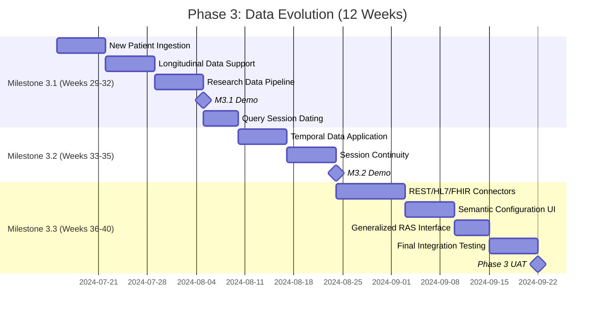

# Phase 3: New Data & Temporal Features (Weeks 29-40)

**Phase Goals:** Enable ongoing data integration, temporal querying, and external data sources

## Project Timeline

## Key Deliverables

1. New Patient Ingestion system
2. Longitudinal Data Support
3. Research Data Pipeline
4. Temporal Data Application
5. REST/HL7/FHIR Connectors
6. Semantic Configuration UI

## Notes

This Gantt chart demonstrates the timeline for Phase 3 of the project, spanning 12 weeks with three major milestones.
