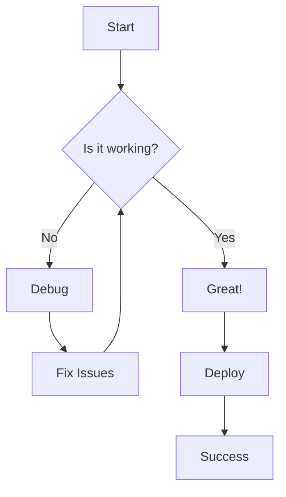
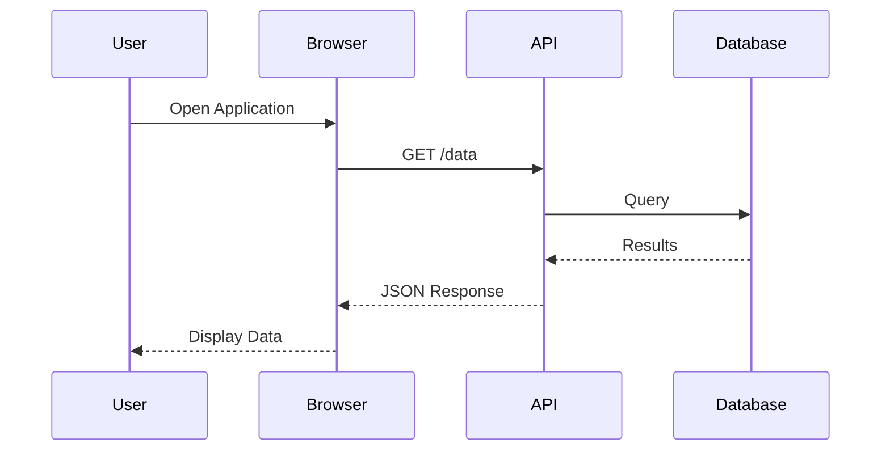
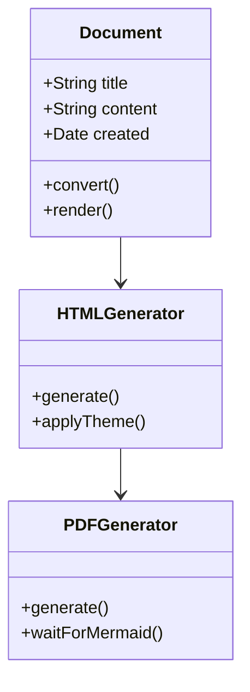

# Sample Document with Mermaid Diagrams

This is a sample document demonstrating `md-mermaid-pdf` features.

## Table of Contents

1. [Introduction](#introduction)
2. [Flowchart Example](#flowchart-example)
3. [Sequence Diagram](#sequence-diagram)
4. [Code Examples](#code-examples)
5. [Tables](#tables)

## Introduction

**md-mermaid-pdf** converts Markdown documents with Mermaid diagrams to beautiful HTML and PDF files.

Features:
- ✅ Full Mermaid.js support
- ✅ Syntax highlighting
- ✅ Professional styling
- ✅ Print-optimized output

## Flowchart Example

Here's a simple workflow represented as a Mermaid flowchart:



## Sequence Diagram

This diagram shows a typical API interaction:



## Code Examples

### JavaScript

```javascript
function convertMarkdown(input, output) {
  const { convertMarkdownFile } = require('md-mermaid-pdf');

  convertMarkdownFile(input, output, {
    title: 'My Document',
    theme: 'default'
  });

  console.log(`✅ Converted ${input} to ${output}`);
}
```

### Python

```python
def process_data(items):
    """Process a list of items"""
    results = []
    for item in items:
        if item.is_valid():
            results.append(item.process())
    return results
```

### Bash

```bash
#!/bin/bash

# Convert all markdown files to PDF
for file in *.md; do
    md-to-pdf "$file" "${file%.md}.pdf"
done
```

## Tables

### Feature Comparison

| Feature | HTML | PDF | Notes |
|---------|------|-----|-------|
| Mermaid Diagrams | ✅ | ✅ | Fully rendered |
| Code Highlighting | ✅ | ✅ | All languages |
| Interactive | ✅ | ❌ | HTML only |
| Print Ready | ✅ | ✅ | Optimized |
| File Size | Small | Medium | PDF is larger |

### CLI Commands

| Command | Purpose | Example |
|---------|---------|---------|
| `md-to-html` | Markdown → HTML | `md-to-html doc.md` |
| `html-to-pdf` | HTML → PDF | `html-to-pdf doc.html` |
| `md-to-pdf` | Markdown → PDF | `md-to-pdf doc.md` |

## Blockquote Example

> **Note:** This package requires Google Chrome or Chromium for PDF generation.
>
> Make sure Chrome is installed on your system or set the `CHROME_PATH` environment variable.

## Lists

### Ordered List

1. First step: Write your markdown
2. Second step: Add Mermaid diagrams
3. Third step: Convert to PDF
4. Fourth step: Enjoy!

### Unordered List

- **Performance**: Fast conversion
- **Quality**: High-resolution output
- **Flexibility**: Multiple themes
- **Compatibility**: Cross-platform

## Advanced Mermaid: Class Diagram



## Conclusion

This sample demonstrates the key features of **md-mermaid-pdf**:

✨ Beautiful diagrams
📄 Professional output
🚀 Easy to use
🎨 Customizable themes

---

**Generated with [md-mermaid-pdf](https://github.com/yourusername/md-mermaid-pdf)**
